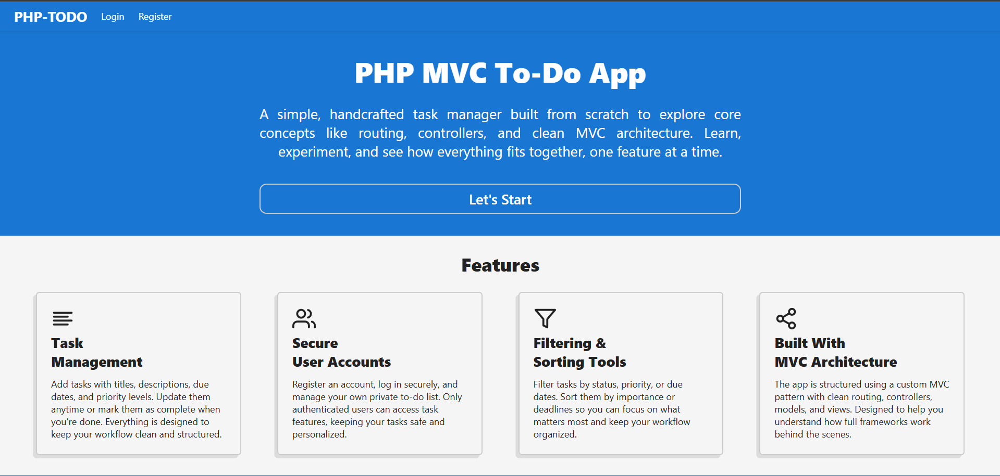
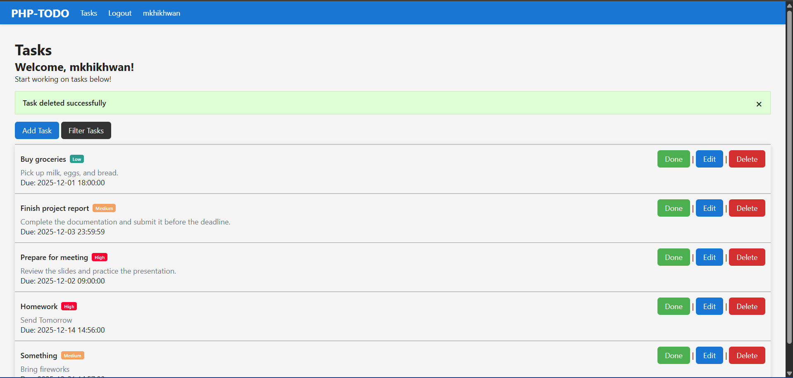
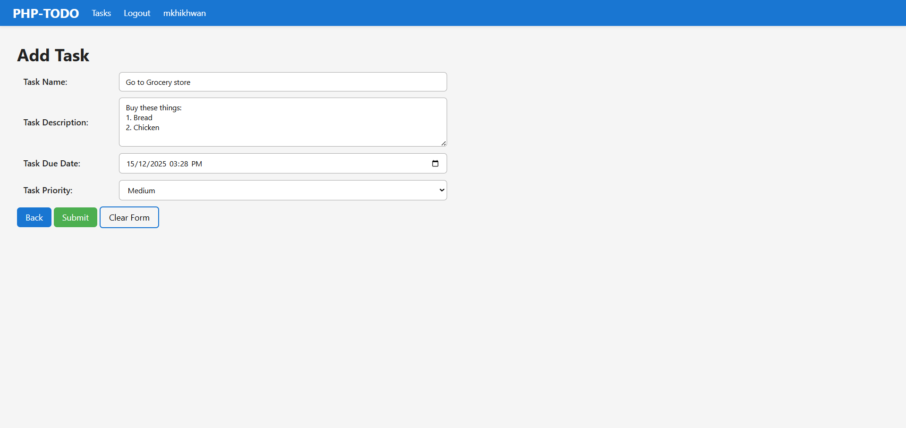
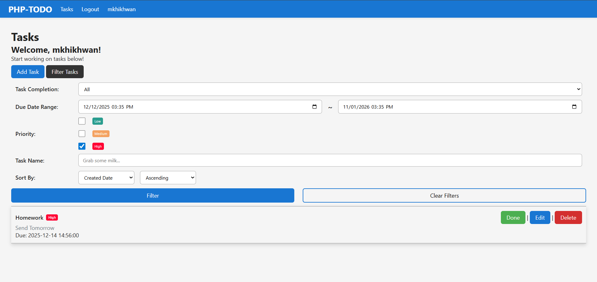

# PHP MVC ToDo App

A simple **ToDo List** application built from scratch using **PHP MVC**, intended for learning purposes. The app demonstrates routing, authentication, and basic task management.

## Status
**Done** – All the features are implemented. Will work on Optional later. 

## Features

### Authentication
- **Register**: Create an account with email and password (securely hashed).  
- **Login/Logout**: Authenticate and end sessions.  
- **Access Control**: Only logged-in users can manage tasks.

### Task Management
- **Create Task**: Add tasks with title, description, due date, and priority.  
- **View Tasks**: List all tasks with details (title, status, due date).  
- **Update Task**: Edit task details and mark tasks as complete/incomplete.  
- **Delete Task**: Remove tasks permanently.

### Task Filtering & Sorting
- **Filter**: By status (all/completed/incomplete), priority, and due date (today/this week/overdue).  
- **Sort**: By due date, creation date, or priority.

### Optional Features (Future Implementation)
- Task search by title  
- Pagination or infinite scrolling  
- Dark mode UI  
- **Admin Control**: Manage users and tasks globally  
- **Middleware Implementation**: Custom route middleware for access control

## Purpose
This project is designed for learning PHP and understanding **MVC architecture**, routing, and user authentication.

## Page Examples

### Landing Page
The initial page shown to users before authentication.

---

### Main Page (After Login)
Displays the user's task list with filtering and sorting options.

---

### Add Task Page
Form for creating a new task with title, description, due date, and priority.

### Filter Tasks
Form popup for filtering tasks on the main page.

